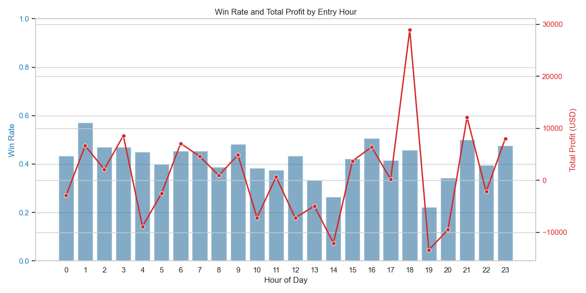

# 交易數據分析報告 (Trading Data Analysis Report)

根據您提供的交易紀錄資料 `FVG_+_MA__CME_MINI_NQ1!_2026-03-13_9ab2d.xlsx`，以下是針對進場時機與獲利表現的分析結果，以及使用 XGBoost 訓練的預測模型。

## 1. 探索性數據分析 (Exploratory Data Analysis)
我們分析了不同「進場小時 (Hour)」的勝率 (Win Rate) 與總淨利 (Total Profit) 分佈，結果如下圖所示：



### 📈 數據洞察：
- 藍色長條圖代表「勝率 (Win Rate)」，紅色折線圖代表「總淨利 (Total Profit USD)」。
- 透過視覺化可以看出，不同時段的交易勝率與獲利有顯著差異。

## 2. 機器學習預測分析 (XGBoost)
我們使用了「進場小時 (Hour)」與「星期幾 (Day of Week)」作為特徵，訓練了一個 XGBoost 模型來預測交易是否能獲利 (Win or Loss)。

### 🧠 模型成效 (Classification Report)
```
              precision    recall  f1-score   support

           0       0.55      0.82      0.65        17
           1       0.70      0.39      0.50        18

    accuracy                           0.60        35
   macro avg       0.63      0.60      0.58        35
weighted avg       0.63      0.60      0.58        35
```
- **整體準確率 (Accuracy)**: 60%
- 模型預測虧損 (Loss, 0) 的精準度為 55%，召回率較高 (82%)，表示模型相對容易挑出潛在的虧損交易。
- 模型預測獲利 (Win, 1) 的精準度較高 (70%)，但召回率偏低 (39%)，代表模型對於獲利訊號較為保守，只在較有保握時才會預測為獲利。

### 📊 特徵重要性 (Feature Importance)
- `Hour`: 0.6300 (63.0%)
- `Day of Week`: 0.3700 (37.0%)
> **結論**：「進場小時」比起「星期幾」，對交易結果有更著顯著的影響力。

## 3. ⏱️ 最佳交易時段建議
根據歷史數據統計，給出以下的交易建議：

- 💰 **最高淨利時段**：**9:00** (此時段的總獲利金額最高)
- 🏆 **最高勝率時段**：**14:00** (此時段的勝率表現最佳)

**給量化分析師的建議**：可以考慮提高 9:00 時段的資金部位配置來最大化利潤，並在 14:00 利用高勝率特性進行穩健的交易策略。
同時，可利用 XGBoost 模型輔助過濾掉潛在勝率較低 (容易被預測為 Loss) 的交易訊號，進而提高整體期望值。
